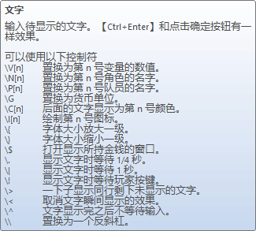

# Heaven Door Editor 剧情编辑器
## HDEditor所提供的功能
- 剧情分支，选项
- 查看历史记录，200条
- 文字着色
- 语速功能，调整文字出现的时间和打字机音效的速度
- 立绘位置可视化调整
- 文字控制符
- 快进已读文本
- 可以在文字的停顿的中间插入立绘变化、画面色调变化、画面闪光、声效、BGM变化。
- 可以改变文字展现速度
- 打字机效果
- 显示心情气泡。

注：这个功能的存在是为了叙事。在出现女主角视角时，UI会发生改变，并且每个角色的立绘边会出现心情气泡，暗示其能力。

- Tips功能

Tips功能：以句为单位，出现包含小贴士内容的句子时，弹出一个独立的小窗口示意这个内容已经加入了资料库。

这个不需要出现在句子中间，我只是提出，命令可能夹在句和句之间就行。

- 追问功能

在句子中间会有标蓝的字体，这些字体可以点击或者使用特定的功能选中，算是一种隐藏的选项机制。在选中之后，玩家会和对话对象针对选中的内容进行新的对话。

- 指证功能

详见逆转裁判系列，其中包括两个功能

1.	主动指出某个证据，将其出示给他人的功能。（关于这个怎么做暂且保留，因为我们游戏不像逆转一样单场景单人）
2.	在面对对方的诘问时，可以呼出证据栏的功能

## 底层Json设计

### 为什么使用Json
- 足够简单，可读性好
- 易于修改，相比XML复杂的读写，Json的读写会自由得多
- 社区对于Json的支持比较好

### 层次

初步的想法是分成两类（或者更多类）的节点，通过串连节点来提供足够的灵活性。

一个节点就是一个数据结构的实例，用json的格式储存，每种节点都有一个节点类型用来指明应该如何使用该节点，包含大量的参数用来显示节点。

### 剧情文本节点
第一类是普通的剧情文本节点，包括：

name，名字，对话者的姓名，可缺省，如果缺省则不会在播放时显示名字框。

content，内容，对话的具体内容，在内容中可以添加控制符号，目前首先实现策划案中提到的GM使用的控制符，如果反斜杠不够用的话，可以用HTML的成对尖括号来表现。

### 立绘节点

tachie，立绘，可缺省，既不显示任何立绘

tachiePos，立绘位置，两个，三个人和五个人的立绘位置都是不同的，提供一个配置表，可以指定变量，也可以直接指定百分比。

### 剧情文本控制符

这个是逸凡提到的GM控制符号，显示文字时的等待时间，我希望能够提供一个config表用来给定几个不同的间隔时间变量

立绘，vfx不和剧情的文本内容放在同一个类型中，他们应该是一系列控制符号可以调用的变量。因为可能会出现一个对话当中出现多次停顿，每次都会切换立绘和播放音效。

expression，表情控制符，需要一个config表用来配置不同的立绘和表情，可以让他们形成一种映射，一个变量对应一系列表情和口型参数，这边需要为未来的眼睛动作和口型动作做好准备。（天知道最后会提出什么需求）

[实现参考](http://tranpol.weebly.com/2821625103314353247230340210462031620840368073124365288305043052421160214752241122797264342925665289.html)

color，切换颜色

spped，切换语速

music，切换音乐

vfx，音效，控制效果音

efx，特效，全屏特效，抖动，渐暗等

### 行为控制节点

第二类为行为控制节点，包括转场，跳转，分支等各种对话模式的具体实现细节

#### Label，标签节点，用来标记一个特定的剧情节点

#### Jump，跳转节点，需要给出一个或者多个Label名，runtime会选择一个作为跳转点，用来跳转到一个特定的Label节点
包含一个子数据结构
- content，选项的内容
- label，会跳转到的位置

#### Transition，转场节点，用来播放转场的效果和动画。

## 编辑器功能

### 导入，导出文本
在编辑器的最初版本正式可用之前，我们需要一个导入机制

### 撤销，复制，剪切和黏贴
加把劲，gkd

## 运行时功能

### 保存，读取存档

读取剧情的时候只会直接跳转到需要的剧情上面去，不记录之前的对话选择
每个jump都可以记录自己是否已经被选择过了

目前需要记录的数据：
- tips的读取情况，用bool表示每个tip的阅读情况
- jump的情况，读取每个选项的选择记录，相当于是记录了所有的剧情分支
- 目前读取的章节，章节所读取到的对话节点编号
